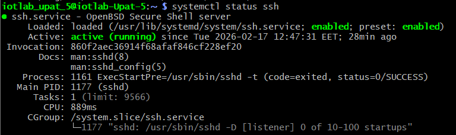

## Section B: Report

**RQ1: What hostname and IP address did you use?**  
Ans: Hostname: iotlab-Upat-5
IP Address: 192.168.137.244

**RQ2: Did DNS resolution work (ping google.com)? If it failed, what does that imply?**  
Ans: Yes, DNS resolution worked succesfully. It implies that the Raspberry Pi has access to a DNS server and can resolve domain names to IP addresses. If it had failed while ping 8.8.8.8 worked, it would mean the device had internet access but couldn't reach a DNS server to translate names.

**RQ3: Was the connection wired or wireless?**  
Ans: The connection was wireless.
Evidence: The ip a output shows the eth0 (wired) interface as DOWN and NO-CARRIER, while the wlan0 (wireless) interface is UP with an assigned IP address of 192.168.137.244.

**RQ4: Which method did you use to enable SSH (GUI or raspi-config)? List the exact steps.**  
Ans: We used the command line configuration method. Steps:
1. Open the terminal
2. Type "sudo raspi-config"
3. Select "Interface Options"
4. Select "SSH"
5. Choose "Enable"
6. Reboot manually once.

**RQ5: What command did you run to verify that SSH is active? Include the relevant output snippet.**    
Ans: We used the command "sudo systemctl status ssh" to verify that SSH is active. The output snippet shows that the SSH service is active.

 

**RQ6: In your own words, why is SSH a necessary tool for managing edge devices after deployment?**  
Ans: It's necessary for remote management of edge devices after deployment. It allows for secure, headless connections with authentication and more automated setup.

**RQ6: What SSH command did you use, and which username ?**  
Ans: `ssh iotlab-upat-5@192.168.137.244`
username: iotlab-upat-5

**RQ7: Did you see a host key prompt the first time? What is that prompt for (in your own words)?**  
Ans: Yes, we saw the host key prompt the first time. It is the first authentication, without SSH key, that asks us to confirm the host key and enter the password we set.

**RQ8: What does uptime tell you that is relevant for edge systems?**  
Ans: The uptime command provides key health metrics for edge systems:

1. System Time: Ensures accurate logs and data synchronization.
2. Uptime Duration: Tracks stability and helps detect unexpected reboots.
3. Active Users: Monitors current SSH sessions and remote access.
4. Load Average: Shows CPU workload to ensure the edge device isn't overwhelmed. 

**RQ9: Did you enable SSH keys? describe the steps briefly.**  
Ans: Yes, we enabled SSH key-based authentication using the following steps in Git Bash:

1. Generated a new SSH key pair using `ssh-keygen -t ed25519`.
2. Verified the creation of the public and private keys with `ls ~/.ssh`.
3. Started the SSH agent using `eval "$(ssh-agent -s)"` and added the private key with `ssh-add ~/.ssh/id_ed25519`.
4. Copied the public key to the Raspberry Pi using `ssh-copy-id iotlab_upat_5@192.168.137.244` to allow passwordless login.

**RQ10: Why are SSH keys generally preferred over passwords for remote access?**  
Ans: SSH keys are preferred for two main reasons:
1. Security: They are much more resistant to brute-force attacks than passwords.
2. Convenience: They enable faster, passwordless, and automated remote access.

**RQ11: Is system time correct? If not, what could break downstream (give two examples)?**  
Ans: System time is correct, incorrect system time triggers "silent" downstream failures:
1. SSL/TLS Failures: Security certificates have strict validity periods. Outdated system time causes tools like apt and pip to reject connections as "insecure," blocking updates and installations.
2. Build & Cache Issues: Tools like Python’s internal caching rely on timestamps.

**RQ12: How much free disk space is available? Why does disk usage matter for logging systems**  
Ans: The available disk space is ~35.7GBytes. The disk usage for logging systems matters because if the disk space runs out, critical system operations may halt, which can prevent the administrators from diagnosing bugs and issues.

**RQ13: What Python version is installed? Why might the Python version affect reproducibility?**  
Ans: Python 3.13 with pip 25.1.1. Based on the python version certain programs may not run, or compile correctly, so we need to make sure we work on the same version of python both on our personal computer and raspberry pi.

**RQ14: Who created the repository and how did you grant access to teammates (briefly)?**  
Ans: One member of the team created the repository. Then he added the rest of the team members as collaborators.

**RQ15:  What would likely go wrong if each team member kept their own local version of the lab/project work?**  
Ans: If each team member kept their own local version of the lab/project work, the project faces three critical risks: code divergence & merge conflicts, loss of accountability & Rollbacks, manual syncing errors.

**RQ16: What is the difference between git add and git commit (in your own words)?**  
Ans: 
1. git add: Selects and moves specific file changes to the Staging Area (the "loading dock") to prepare them for the next update.
2. git commit: Creates a permanent, timestamped snapshot of all staged changes in the project history with a descriptive message.

**RQ17: What does git push do, and why is it important in a team setting?**  
Ans: The git push command pushes all the changes that were created by a singular user to the github repository so that the rest of the team's members have access to the new source code.

**RQ18: Can you think what problem can happen if two teammates edit the same file without pulling first?**  
Ans: If 2 people edit the same file without pulling first, there will be conflicts. Conflicts happen when the user removes, or adds new lines of code that overlap the change of the other user. 

**RQ19: Did your team use branches? If yes, describe your workflow briefly. If no, explain why.**  
Ans: We used branch for test purposes. Specifically, we created a test branch, named `my-test-branch`. The change made in the repository is the creation of a test file name `test.txt`, location: `labs/lab01/test.txt`

**RQ20: What is a merge conflict, and when does it happen?**    
Ans: A merge conflict is when changes have been made to the same part of a file by two people or more when we push the file in a github repository.

**RQ21: Which authentication method did you use to push to GitHub (HTTPS+token, SSH key, other)? Why?**  
Ans: On our personal computer, each team member uses the SSH key from their laptop. On the raspberry pi we have setup an SSH key that we linked with our repository, since HTTPS password authentication is not supported for Git operations. That way we can have access to a private repository, and push/pull access. 

**RQ22: Why should virtual environments not be committed to git?**  
Ans: Virtual environments are machine-specific and do not work on different computers and take up a lot of space unnecessarily.

**RQ23: Why is it usually not acceptable to commit logs?**  
Ans: Logs do not contain a part of the source code, and are large files that can slow down operations.

**RQ24: Where on the Pi did you clone the repo (path)? Why did you choose that location?**  
Ans: The home directory of the raspberry Pi, that is also the first directory of the terminal. This way we can access faster the lab's files instead of navigating through the `change directory (cd)` command.

**RQ25: What did sys.executable show, and how does that prove you are using the venv?**  
Ans: `sys.executable` output: `/home/iotlab_upat_5/venv/bin/python`
Significance: This confirms the shell is using the isolated Python interpreter located within the project's local venv directory, rather than the global system-wide Python. 

**RQ26: In one paragraph: what problem does a venv solve?**  
Ans: A venv solves the problem of dependency conflicts between different python projects by creating isolated environments where each project can have its own set of installed packages and specific versions, without interfering with the global Python installation or other projects.

**RQ27: What dependencies did you include and why? If you use argaprse do you need to include the requirements.txt, if not why?**  
Ans: Since we are testing the venv we download the click module for a better structured CLI. We add the click version in the requirements.txt file (click==8.1.7). The argaprse package comes installed with any python version >=3.2, so we do not need to include it in the requirents.txt file.

**RQ28: What would happen if different teams used different dependency versions?**  
Ans: Using different dependency versions across teams leads to "broken" code where specific features or libraries might be missing or incompatible, causing the program to fail. That's why we use virtual environments, in order to isolate each project's dependencies, ensuring that every team member runs the exact same environment and preventing conflicts with system-wide packages.

**RQ29: How can you verify you installed packages into the venv (not the system Python)? Give one command and explain what you look for.**  
Ans: Run pip list after activating your virtual environment. If the packages you installed appear in the output, they are installed in the venv. 


**RQ31: Why might it be useful to start with a mock event generator instead of connecting real hardware immediately?**  
Ans: It allows software development (backend, data pipelines, UI) to proceed in parallel without waiting for hardware availability. It provides predictable, extreme, and easily reproducible edge cases that might be dangerous or difficult to trigger on real physical hardware.

**RQ32: What aspects of the system can you test with this mock that are independent of sensors?**  
Ans: We can test CLI parsing, events, and JSON line logs.

**RQ33: Why is it useful to distinguish between “activity” events (like deposit) and “liveness” events (like heartbeat)?**  
Ans: Distinguishing these two types of events separates functional data from system health. 

**RQ34: Give one example of how a system might misbehave if heartbeats were missing.**  
Ans: If a bin remains unused for a long time, the system might think that the wastebin is offline or broken, even if it is working properly because it does not receive any heartbeats.

**RQ35: Which optional parameters (if any) did you add, and why?**  
Ans: We added `--starting-total` to simulate restarting an application with an existing total count of waste and `--verbose` to allow human operators to monitor the log appending in real time without interfering with the JSON lines structure.

**RQ36: Why is it important that invalid CLI arguments fail early and clearly?**  
Ans: Failing early with a clear message prevents the script from running half-way, generating or executing corrupted data. 

**RQ37: Why is JSON Lines a good fit for append-only event logs?**  
Ans: With JSON Lines, each line is a valid JSON object, so we can simply append new lines to the file without breaking the overall structure. This makes it easy to add new events without modifying the entire file. 

**RQ38: Why is it useful to include both seq and timestamps in each record?**  
Ans: Because it allows us to see the time a record is emitted, allowing us to see the time periods the wastebin is beeing used the most and the times it isn't, allowing us to shedule the eptying of the bin, maybe even turn off the bin for energy saving the times it isn't beeing used. The seq number allows us to see the exact number of records written, which is useful for debugging and ensuring that no records are lost or duplicated.

**RQ39: Why should deposit_total be monotonically increasing within a run?**  
Ans: `deposit_total` tracks the amount of waste deposited. Because waste cannot be "undeposited" in this context (only emptied during a separate maintenance event), the total count must strictly grow over the lifecycle of the device to represent physical reality accurately.

**RQ40: Which of the above correctness rules would be hardest to verify manually, and why?**    
Ans: The deposit_total, because two or more users could use the bin at the same time, essentially counting all of them as 1 deposit, even though technically we had as many as the number of individual users, or the lid of the bin could be left open which creates more problems for us.

**RQ41: What problems arise if operational messages are mixed into event logs?**  
Ans: Mixing human-readable text like "Error occurred" or "Started successfully" into a file meant purely for JSON parsers will cause the automated parser to crash on that line because the file is no longer strictly JSONL compliant.

**RQ42: Why might operational logs still be essential during debugging?**  
Ans: While the event log tells us what happened in the application domain, the operational log tells us how the application process is running. 

**RQ43: Why is it important to distinguish usage errors from runtime errors?**  
Ans: Usage errors (like passing `--count 0`) mean the user is at fault and needs to fix their command. Runtime errors (like a full hard drive) mean the environment or logic is at fault. This way we can debug the issue properly.

**RQ44: How could consistent exit codes be useful in automated systems?**  
Ans: An automated script can read exit codes. For example, if it receives code 2 (usage error), it might stop and alert the user. If it receives code 1 (runtime error), it might attempt an automatic retry.

**RQ45: What could go wrong if a program is terminated without handling interrupts properly?**  
Ans: A program without interrupt handling might not close files properly, leading to data corruption or loss. It might also leave temporary files behind or fail to release system resources, causing instability.

**RQ46: Show the first and last JSON record produced by this test and explain how the counters changed.**  
Test Run:
`python event_generator.py --device-id wastebin-01 --event-type deposit --count 5 --interval 0.1 --out test.jsonl --starting-total 0 --verbose`

First Line:
`{"event_time": "2026-02-26T12:55:53.279Z", "ingest_time": "2026-02-26T12:55:53.279Z", "device_id": "wastebin-01", "event_type": "deposit", "seq": 1, "run_id": "9512b3cb-c6a6-42c6-b34d-593e66506c03", "deposit_delta": 1, "deposit_total": 1}`

Last Line:
`{"event_time": "2026-02-26T12:55:54.082Z", "ingest_time": "2026-02-26T12:55:54.082Z", "device_id": "wastebin-01", "event_type": "deposit", "seq": 5, "run_id": "9512b3cb-c6a6-42c6-b34d-593e66506c03", "deposit_delta": 1, "deposit_total": 5}`

Ans: The deposit_total starts at 1 and ends at 5, because we started with a starting_total of 0 and we generated 5 events, each event incrementing the deposit_total by 1. Same with seq, it starts at 1 and ends at 5, because we generated 5 events.

**RQ47: How can a consumer distinguish heartbeat records from deposit records in the log?**  
Ans: Via the event_type field. Heartbeat records have "event_type": "heartbeat" and deposit records have "event_type": "deposit".

**RQ48: For each invalid command, show the error message and exit code.**  
Ans: We performed two tests.
The first test was:
`python event_generator.py --device-id wastebin-01 --event-type heartbeet --count 5 --interval 0.1 --out test.jsonl --starting-total 0 --verbose`

Error message:
```text
Usage: event_generator.py [OPTIONS]
Try 'event_generator.py --help' for help.

Error: Invalid value for '--event-type': 'heartbeet' is not one of 'deposit', 'heartbeat', 'lid_open', 'lid_close', 'maintenance_start', 'maintenance_end', 'sensor_error', 'waste_full'.
```
Exit Code: `2`

The second test was:
`python event_generator.py --device-id wastebin-01 --event-type heartbeat --count 0 --interval 0.1 --out test.jsonl --starting-total 0 --verbose`

Error message:
`Error: --count must be > 0`

Exit Code: `2`

**RQ49: Which invalid input do you think is most likely in real usage, and why?**  
Ans: An invalid `--event-type` due to typos (like typing "heartbeet") or omitting a required argument like `--out` are the most likely issues. When manually typing these commands mistakes may be made.


**RQ50: How many records were written before interruption?**  
Ans: 13 records were written before the script was manually interrupted by the user (`Ctrl+C`).

Test Run:
```powershell
python event_generator.py --device-id wastebin-01 --event-type heartbeat --count 200 --interval 0.1 --out events.log                       

Interrupted by user. Wrote 13 records.
```


**RQ51: List at least five concrete problems in the bad README that would block or confuse a new team. Be specific (quote or reference the problematic line/section).**
Ans: 
1. Vague SSH command (`ssh raspberrypi`): It lacks the required username (e.g., `pi@<IP>`) and assumes the Pi is discoverable by hostname without explaining how to find its IP address.

2. Missing repository clone: The instruction `cd lab01` assumes the user has already downloaded the project, completely skipping the essential git clone step.

3. Non-executable dependency installation: The instruction `pip install (see my imports...)` is not copy-pasteable. It forces the user to manually guess libraries instead of providing a standard `pip install -r requirements.txt` command.

4. Failure to activate the virtual environment: It instructs the user to create the venv (`python -m venv venv`) but skips the critical activation step (e.g., `source venv/bin/activate`), which will lead to incorrect global package installations.

5. Ambiguous expected output: It vaguely states "You can check the file" without specifying the file's name, its location, or what a successful execution actually looks like.