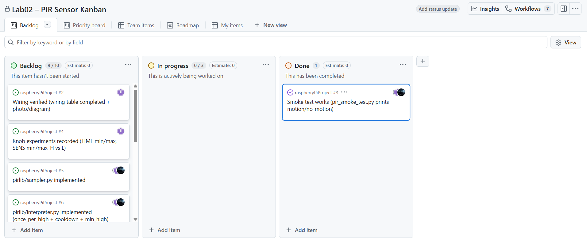
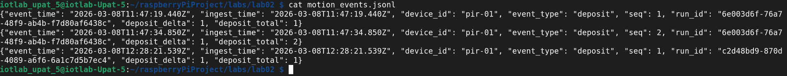
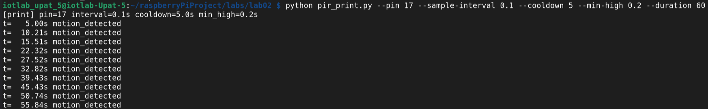
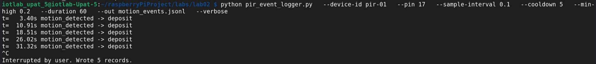

**RQ1: Is a PIR sensor active or passive? Contact or no-contact? Explain in your own words.**

Ans: Passive, no-contact because it detects the infrared radiation emitted by objects, rather than emitting its own signal.


**RQ2: What is the output range/representation of this sensor?**

Ans: The HC-SR501 sensor that we used in this lab has an adjustable detection range from ~3m to ~7m, and and adjustable output high time from ~3s to ~300s. The output is a digital signal, which is high when the sensor detects motion and low when it does not.


**RQ3: If TIME is set to 300s, what wrong assumption might your software make about “continuous motion”?**

Ans: When a small movement occurs even for 1 second, the sensor will assume that movements exists for 300s, which is not true. 


**RQ4: Why does warm-up time matter in real deployments?**

Ans: In real deployments, the sensor must be stable without providing false triggers so adjusting to the rooms IR levels is critical.


**RQ5: Explain a realistic bug that happens when a team mixes BCM and BOARD numbering.**

Ans: The most common bug is that the code will not work as expected, because the pins are not connected to the correct pins. For example, if a team member uses BCM numbering when the code is written in BOARD numbering, the code will not work as expected.


**RQ6: Fill in the wiring table for your setup (use your actual pins).**

Ans: 
| Sensor pin| Pi Pin (physical) | Pi name (BCM) | Why |
|-----------|------------------------|--------------------------|-----|
| VCC | 2 | 5V | Power |
| GND | 6 | GND | Reference |
| OUT | 11 | GPIO17 | Input Signal |


**RQ7: Which GPIO pin did you select (BCM) and why?**

Ans: We picked the GPIO pin GPIO17 that is not reserved for special functions and is easy to find on the header, as instructed.


**RQ8: Paste the command you ran for the smoke test and a short snippet of output.**

Ans: 
```bash
python3 pir_smoke_test.py
```


We had a problem using the python venv. So, we disabled it, as instructed by the Lab Assistants.


**RQ9: With TIME at minimum, approximately how long did OUT remain HIGH after motion?**

Ans: approximately 1.37 seconds


**RQ10: With TIME at maximum, approximately how long did OUT remain HIGH after motion?**

Ans: approximately 30 seconds


**RQ11: What was the maximum distance at which you reliably triggered motion at low sensitivity vs high sensitivity?**

Ans: Low sensitivity: Less than half a meter

High sensitivity: Approximately 6 meters

**RQ12: Describe the observed difference between H and L mode in your own words (based on your experiment).**

Ans: The output on H mode remains HIGH as long as continuous movement is being detected, and the output on L mode remains HIGH the seconds set by TIME when it detects motion, and then turns LOW, even if the motion continues.


**RQ13: Paste your sys.executable output and explain how it proves you are using the venv.**

Ans: /home/iotlab-upat-5/raspeberryPiProject/labs/lab02/venv/bin/python3

This proves that we are using the venv because the path points to the venv directory.


**RQ21: Provide a screenshot of your board.**



**RQ22: Give one concrete example of how the board can prevent a coordination bug (e.g., wrong pin, duplicated work, missed experiment).**

Ans: The board prevents duplicated work by providing a visual reference of which pins are being used, so that team members do not use the same pins for different purposes.     

**RQ23: Which card can be a “critical path” blocker for your team, and why?**

Ans: The "Run the experiment" card is a critical path blocker because it requires the completion of all previous steps, including the hardware setup and the software development. If this card is not completed, the experiment cannot be run, and the lab cannot be completed.    

**RQ14: What sample interval did you choose and why? (Use your knob experiments to justify it.)**

Ans: We chose a sample interval of `0.1` seconds. Based on our knob experiments, the minimum time the sensor's output remains `HIGH` after detecting motion is approximately 1.37 seconds. A sampling rate of 0.1s guarantees that we read the sensor state multiple times during the shortest possible `HIGH` pulse, ensuring we never miss a motion event without unnecessarily overloading the Raspberry Pi's CPU.


**RQ15: What cooldown did you choose and why?**

Ans: We chose a cooldown of `5.0` seconds. In the context of a smart wastebin, when an individual approaches to deposit an item, they will likely trigger the sensor continuously for a few seconds. The cooldown prevents the system from generating multiple "deposit" events for a single interaction by forcing it to ignore subsequent motion triggers until the person has had time to walk away.


**RQ16: Did you observe brief spikes? What min_high did you choose (or why did you keep it 0)?**

Ans: Yes, inexpensive PIR sensors occasionally have brief signal spikes or false positives due to electrical noise or rapid lighting changes. We chose a `min_high` of `0.2` seconds. This value successfully filters out instantaneous noise spikes, ensuring we only register an event if the sensor maintains a `HIGH` signal for a sustained period indicating genuine physical motion.


**RQ17: Compute and report latency for 3 records.**

Ans: Latency is the difference between the `event_time` and the `ingest_time`. Since both timestamps are identical at creation in our local generation script, the calculated latency is 0 ms, meaning it is close to microseconds.


**RQ18: In your own words, explain how your interpreter prevents “motion detected” spam.**

Ans: The `PirInterpreter` implements three software controls:
1. State-Tracking: Uses a boolean property `emitted_for_this_high` which flips to `True` when an event is triggered during a continuous `HIGH` state. This prevents endless "motion detected" events while someone remains in front of the sensor.
2. Cooldown Period: Analyzes the delta time since the last emitted event against a configured cooldown, ignoring subsequent triggered motions until the cooldown duration has elapsed.
3. Minimum High Duration: Enforces that the sensor pulse must remain persistently `HIGH` for `min_high_s` before an event evaluates to `True`, protecting against instantaneous noise.


**RQ19: Show a short output snippet of pir_print.py**

Ans:


**RQ20: Show a short output snippet of pir_event_logger.py**

Ans:
