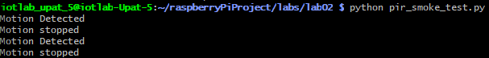

**RQ1: Is a PIR sensor active or passive? Contact or no-contact? Explain in your own words.**

Ans: Passive, no-contact because it detects the infrared radiation emitted by objects, rather than emitting its own signal.


**RQ2: What is the output range/representation of this sensor?**

Ans: The HC-SR501 sensor that we used in this lab has an adjustable detection range from ~3m to ~7m, and and adjustable output high time from ~3s to ~300s. The output is a digital signal, which is high when the sensor detects motion and low when it does not.


**RQ3: If TIME is set to 300s, what wrong assumption might your software make about “continuous motion”?**

Ans: When a small movement occurs even for 1 second, the sensor will assume that movements exists for 300s, which is not true. 


**RQ4: Why does warm-up time matter in real deployments?**

Ans: In real deployments, the sensor must be stable without providing false triggers so adjusting to the rooms IR levels is critical.


**RQ5: Explain a realistic bug that happens when a team mixes BCM and BOARD numbering.**

Ans: The most common bug is that the code will not work as expected, because the pins are not connected to the correct pins. For example, if a team member uses BCM numbering when the code is written in BOARD numbering, the code will not work as expected.


**RQ6: Fill in the wiring table for your setup (use your actual pins).**

Ans: 
| Sensor pin| Pi Pin (physical) | Pi name (BCM) | Why |
|-----------|------------------------|--------------------------|-----|
| VCC | 2 | 5V | Power |
| GND | 6 | GND | Reference |
| OUT | 11 | GPIO17 | Input Signal |


**RQ7: Which GPIO pin did you select (BCM) and why?**

Ans: We picked the GPIO pin GPIO17 that is not reserved for special functions and is easy to find on the header, as instructed.


**RQ8: Paste the command you ran for the smoke test and a short snippet of output.**

Ans: 
```bash
python3 pir_smoke_test.py
```


We had a problem using the python venv. So, we disabled it, as instructed by the Lab Assistants.


**RQ9: With TIME at minimum, approximately how long did OUT remain HIGH after motion?**

Ans: approximately 1.37 seconds


**RQ10: With TIME at maximum, approximately how long did OUT remain HIGH after motion?**

Ans: approximately 30 seconds


**RQ11: What was the maximum distance at which you reliably triggered motion at low sensitivity vs high sensitivity?**

Ans: Low sensitivity: Less than half a meter

High sensitivity: Approximately 6 meters

**RQ12: Describe the observed difference between H and L mode in your own words (based on your experiment).**

Ans: The output on H mode remains HIGH as long as continuous movement is being detected, and the output on L mode remains HIGH the seconds set by TIME when it detects motion, and then turns LOW, even if the motion continues.


**RQ13: Paste your sys.executable output and explain how it proves you are using the venv.**

Ans: /home/iotlab-upat-5/raspeberryPiProject/labs/lab02/venv/bin/python3

This proves that we are using the venv because the path points to the venv directory.

