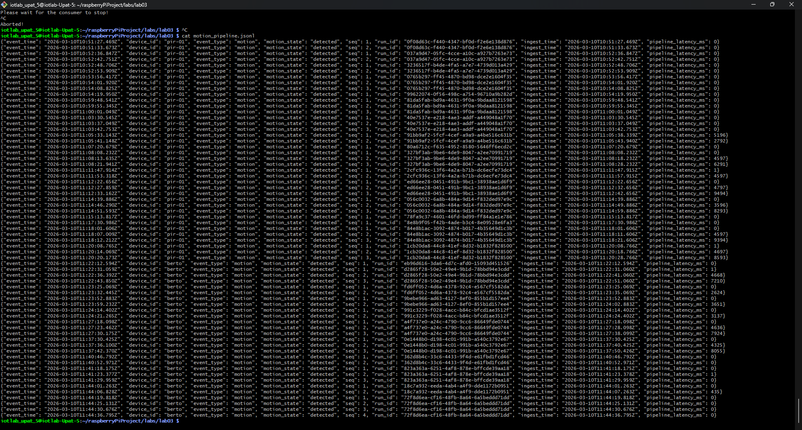

**RQ1: Which lecture pipeline phases do you believe you had already implemented in Lab 02?**

Ans: Based on the lab description, the pipeline phases already implemented in Lab 02 were reading the raw sensor input (acquisition), interpreting the signal behavior to create event records (processing/packaging), and writing the output. While these core phases were present, they were executed in a synchronous, tightly coupled loop (read → interpret → write), rather than the decoupled Producer-Queue-Consumer architecture introduced in the current lab.

**RQ2: Which part of your Lab 02 code did you reuse directly?**

Ans: We used directy the files: sampler.py and interpreter.py.

**RQ3: Which part did you have to adapt for the pipeline architecture?**

Ans: To adapt the system for the pipeline architecture, the core execution loop had to be modified from a sequential process into an explicit, concurrent one. The main adaptation was introducing a queue to decouple the data generation phase (Producer) from the data writing phase (Consumer). Additionally, because the producer might generate events faster than the consumer can write them, a backpressure mechanism had to be integrated—specifically using a drop-newest policy to handle cases where the queue reaches its maximum capacity.

**RQ4: In your own words, why is a queue useful between acquisition and writing?**

Ans: Because the FIFO logic that the queue follows imitates the pipeline logic, meaning that in the one end we acquire infirmation and in the other end we write the information, like a pipeline's two openings.

**RQ5: What is backpressure?**

Ans: Backpressure is a flow control mechanism that helps control information between system components to help with system failures, latency spikes and memory crashes.

**RQ6: Why can a slow writer become a data acquisition problem and not just a storage problem?**

Ans: Because data acquisition systems usually depend on continuous streams of data to perform like they're intended to, so a slow writer could cause the queues that help store data to overflow, losing valuable information in the process, like creating a bottleneck on incoming information.

**RQ7: Is your current edge pipeline closer to ETL or ELT? Explain briefly.**

Ans: Based on the pipeline flow, the system architecture represents an ETL (Extract → Transform → Load) model. The raw data is first extracted from the PIR sensor (Extract). Then, it is immediately processed by the interpreter to detect events before being placed in the queue (Transform). Finally, the consumer thread writes these processed event records to the JSONL event log on the disk (Load). Because the transformation happens before the data is written to storage, it is an ETL approach rather than ELT.

**RQ8: What transformation already happens before your data is written to disk?**

Ans: Before the data is written to the disk, the raw binary signal (0s and 1s) from the PIR sensor undergoes significant transformation and enrichment. First, the PirInterpreter processes the continuous raw signal, applying logic (such as minimum high time and cooldown limits) to transform it into distinct, meaningful "motion events." Second, these events are enriched with metadata to form a structured record. This includes adding a unique run identifier (run_id), a sequence number (seq), precise timestamps (event_time and ingest_time), and dynamically calculating the pipeline_latency_ms. Only after this structural transformation and enrichment is the data written to the JSONL log.

**RQ9: Give one example of a transformation that could be moved later to another stage of the system.**

Ans: The transformation that could be moved later to another stage of the system is the enrichment of the events with metadata. This could be moved to the consumer stage, where the events are processed and written to the disk.

**RQ10: Explain the responsibility of the producer in one sentence.**

Ans: The responsibility of the producer is producing events slower or with the same speed that the consumer processes them so that the queue doesn't overflow and create backpressure problems.

**RQ11: Explain the responsibility of the consumer in one sentence.**

Ans: The responsibility of the consumer is processing events faster or with the same speed that the producer is generating them so that the queue doesn't overflow and create backpressure problems.

**RQ12: Show two example JSONL records from your output and explain their fields briefly.**

Ans: 

**RQ13: What does pipeline_latency_ms mean in your system?**

Ans: It means the time between producing and processing of an event.

**RQ14: What changed when you introduced --consumer-delay 0.5?**

Ans: The consumer thread now sleeps for 0.5 seconds after processing an event. We cannot observe any changes in the output file because the producer produces an event every 5 seconds.

**RQ15: Did the queue absorb the slowdown? Explain briefly using your own observations.**

Ans: Yes, it did. When the producer was outrunning the consumer, the queue was filling up. In a real-time system without a queue, this would cause the producer to slow down or stop, which is not ideal.

**RQ16: What is one clear sign, from your terminal status output, that the producer is outrunning the consumer?**

Ans: When the queue is filling up, then the producer is outrunning the consumer.

**RQ17: Why is a bounded queue more informative than an unbounded queue during overload?**

Ans: A bounded queue is more informative than an unbounded queue during overload because it shows the maximum size of the queue, which can help identify the source of the problem and take appropriate action.

**RQ18: Why should status lines stay in the terminal instead of being mixed into the JSONL file?**

Ans: The status lines are important for debugging and monitoring the system, so they should stay in the terminal.

**RQ19: Which field lets you group records from the same program execution, and why is that useful?**

Ans: The "device_id" and the "run_id" fields lets you group records from the same program execution, and it is useful because it helps identify the source of the records.

**RQ20: Why would an unbounded queue be dangerous on a Raspberry Pi?**

Ans: An unbounded queue would be dangerous on a Raspberry Pi because it would cause the system to run out of memory, which could lead to a crash.

**RQ21: If you later replaced the JSONL writer with another output component, which part of your system could stay almost unchanged and why?**

Ans: The sampler and the interpreter could stay almost unchanged because they are not dependent on the output component. Then the producer and the consumer would need to be changed to work with the new output component. 
