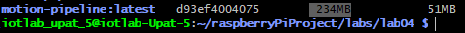

# Section A: Runbook (How to run our code)

*(Add instructions on how to build and run the pipeline here)*

## Section B: Report

**RQ1: What base image did you use and why?**

Ans: We used the `python:3.11-slim` base image. We chose this image because it is a lightweight version of the official Python 3.11 image.

**RQ2: How many layers does your Dockerfile create? Which instructions produce new layers?**
 
Ans:  Our Dockerfile creates 6 layers. The instructions that produce new layers are: FROM, COPY, RUN, COPY, CMD. The workdir instruction does not create a new layer. [WORKDIR instruction](https://dockerlabs.collabnix.com/beginners/dockerfile/WORKDIR_instruction.html)

**RQ3: What is the size of your built image?**

Ans: The size of our image is 234MB. 

**RQ4: Why do we copy requirements.txt and install dependencies before copying the rest of the code? What would happen if we reversed the order?**

Ans: Layers are cached. This means the order of instructions matters a lot for build speed. If we reversed the order, Docker would have to reinstall all packages from scratch every time we change the code.

**RQ5: What does --device /dev/gpiomem do and why is it needed?**

Ans: --device /dev/gpiomem gives the Docker container access to the host’s GPIO memory device. This is required because containers are isolated from hardware by default. Without this flag, the application cannot access the GPIO pins and will fail to read data from the PIR sensor.

**RQ6: What happens to the JSONL output if you run the container without a volume mount (-v)?**

Ans:  If we run the container without a volume mount (-v), the output file would be lost and not accessible from the host system. 

**RQ7: Did the pipeline behave the same inside Docker as it did running directly on the Pi in Lab 03? Any differences?**

Ans: Yes, it did behave the same. The only difference was setting up the volume mount. 

**RQ8: What happened when you set --memory=32m? Does this work on the PI? Why yes, why not?**

Ans: Setting memory limits on docker does not work, because it is not supported by the Raspberry Pi's kernel.

**RQ9: Why are resource limits important on edge devices in general?**

Ans: 

**RQ10: What is the advantage of writing a docker-compose.yml instead of using docker run with flags?**

Ans: 

**RQ11: What is the difference between a bind mount (-v $(pwd)/output:/data) and a named volume (pipeline-data:/data)?**

Ans: 

**RQ12: What does restart: unless-stopped do and why does it matter for an edge device?**

Ans: 
**RQ13: What does a virtual environment isolate, and what does it not isolate?**

Ans: A virtual environment isolates Python dependencies and packages for a project, ensuring they don’t conflict with other projects on the same system. However, it does not isolate the operating system, hardware, or system-level resources. Unlike containers, it still shares the same OS, kernel, and hardware with the host.

**RQ14: Give one concrete example where a requirements.txt and a venv would not be enough to reproduce your Lab 03 setup on a different machine.**

Ans: A concrete example is attempting to run the project on a standard laptop (Windows/Mac) instead of a Raspberry Pi. While venv and requirements.txt would successfully install the required Python packages (like gpiozero), the application would crash because the laptop lacks the hardware. Virtual environments only isolate and manage Python dependencies, and they cannot provide missing hardware.

**RQ15: Give one scenario where a virtual environment is perhaps a better choice than Docker.**

Ans: A virtual environment is a better choice when you are developing a simple Python application that only depends on Python packages and does not require system-level isolation or special hardware access. It is lightweight, faster to set up, and easier to use than Docker for local development. 

**RQ16: In the context of the Smart Wastebin project, which approach (venv or Docker) would you prefer to use for a final deployment, and why?**

Ans: For the Smart Wastebin project, Docker is the preferred choice for final deployment. It ensures the application runs consistently across devices, includes all dependencies, and can safely access hardware like sensors (GPIO). Unlike a virtual environment, Docker provides full isolation and reproducibility, which is critical for deployment on multiple Raspberry Pis or other systems.
