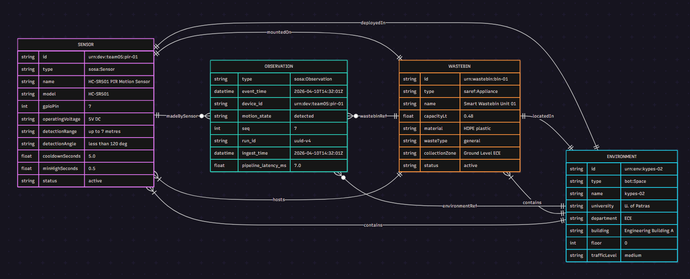

# Lab 05 — Context-aware Data Modeling

## Section A: Code / Runbook

### Repository structure

```
lab05/
├── models/
│   ├── context.jsonld
│   ├── sensor.jsonld
│   ├── wastebin.jsonld
│   └── environment.jsonld
├── run_pipeline.py
├── requirements.txt
└── README.md
```

### How to run the pipeline

```bash
# 1. Create & activate virtualenv
python3 -m venv venv && source venv/bin/activate

# 2. Install dependencies
pip install -r requirements.txt

# 3. Run the pipeline (on the Raspberry Pi)
python run_pipeline.py \
  --device-id  pir-01 \
  --pin        7 \
  --sample-interval 0.1 \
  --cooldown   5.0 \
  --min-high   0.5 \
  --queue-size 64 \
  --duration   60 \
  --out        motion_output.jsonl \
  --verbose
```
### How the pipeline produces self-describing output

`run_pipeline.py` loads `models/context.jsonld` on startup and inlines the `@context` in **every** JSONL record. Each observation also carries `@type: "sosa:Observation"` plus three entity references (`sensor_ref`, `wastebin_ref`, `environment_ref`) that point back to the model files via their `@id` URIs.

**Example output line**:

```json
{
  "@context": {
    "@vocab": "https://schema.org/",
    "sosa": "http://www.w3.org/ns/sosa/",
    "ssn": "http://www.w3.org/ns/ssn/",
    "saref": "https://saref.etsi.org/core/",
    "bot": "https://w3id.org/bot#",
    "xsd": "http://www.w3.org/2001/XMLSchema#",
    "schema": "https://schema.org/",
    "pipeline": "https://github.com/jimfil/raspberryPiProject/blob/main/docs/ontology.md#",
    "event_time": {"@id": "sosa:resultTime", "@type": "xsd:dateTime"},
    "device_id": {"@id": "sosa:madeBySensor", "@type": "@id"},
    "event_type": "@type",
    "motion_state": "pipeline:motionState",
    "seq": {"@id": "pipeline:sequenceNumber", "@type": "xsd:integer"},
    "run_id": {"@id": "pipeline:runId", "@type": "xsd:string"},
    "ingest_time": {"@id": "pipeline:ingestTime", "@type": "xsd:dateTime"},
    "pipeline_latency_ms": {"@id": "pipeline:pipelineLatencyMs", "@type": "xsd:float"},
    "sensor_ref": {"@id": "pipeline:sensorRef", "@type": "@id"},
    "wastebin_ref": {"@id": "pipeline:wastebinRef", "@type": "@id"},
    "environment_ref": {"@id": "pipeline:environmentRef", "@type": "@id"}
  },
  "@type": "sosa:Observation",
  "device_id": "urn:dev:team05:pir-01",
  "sensor_ref": "urn:dev:team05:pir-01",
  "wastebin_ref": "urn:wastebin:bin-01",
  "environment_ref": "urn:env:kypes-02",
  "event_time": "2026-04-10T14:32:01.123Z",
  "event_type": "motion",
  "motion_state": "detected",
  "seq": 7,
  "run_id": "d1f3a2b4-5678-9abc-def0-123456789abc",
  "ingest_time": "2026-04-10T14:32:01.130Z",
  "pipeline_latency_ms": 7.0
}
```

---

### JSON-LD Models

#### `models/sensor.jsonld`

```json
{
  "@context": "context.jsonld",
  "@id": "urn:dev:team05:pir-01",
  "@type": "sosa:Sensor",
  "name": "HC-SR501 PIR Motion Sensor",
  "description": "HC-SR501 passive infrared (PIR) motion sensor mounted on wastebin bin-01 in the lab environment. Detects motion by sensing changes in infrared radiation emitted by warm bodies within its detection cone.",
  "manufacturer": "Generic / HICHIP",
  "model": "HC-SR501",
  "sosa:observes": "sosa:Motion",
  "ssn:detects": "Changes in infrared radiation from warm bodies (humans) moving within the detection cone",
  "pipeline:gpioPin": 7,
  "pipeline:operatingVoltage": "5V DC",
  "pipeline:detectionRange": "up to 7 metres",
  "pipeline:detectionAngle": "less than 120 degrees cone",
  "pipeline:cooldownSeconds": 5.0,
  "pipeline:minHighSeconds": 0.5,
  "pipeline:operatingTemperature": "-15°C to +70°C",
  "pipeline:indoorOutdoor": "indoor",
  "pipeline:mountedOn": { "@id": "urn:wastebin:bin-01" },
  "pipeline:deployedIn": { "@id": "urn:env:kypes-02" },
  "installationDate": "2026-03-31",
  "pipeline:statusSensor": "active",
  "identifier": "pir-01"
}
```

#### `models/wastebin.jsonld`

```json
{
  "@context": "context.jsonld",
  "@id": "urn:wastebin:bin-01",
  "@type": "saref:Appliance",
  "name": "Smart Wastebin Unit 01",
  "description": "An IoT-enabled outdoor waste collection bin located in kypes-02, University of Patras. Equipped with a PIR motion sensor to detect deposit activity.",
  "pipeline:capacityLt": 0.48,
  "pipeline:material": "HDPE plastic",
  "pipeline:color": "grey,blue",
  "pipeline:lengthCm": 6.5,
  "pipeline:widthCm": 7,
  "pipeline:heightCm": 14.5,
  "pipeline:wasteType": "general",
  "pipeline:collectionZone": "Ground Level of ECE Building",
  "pipeline:collectionRoute": "Classrooms 6-8, CCCS 1-3(kypes aithouses)",
  "pipeline:statusBin": "active",
  "sosa:hosts": [{ "@id": "urn:dev:team05:pir-01" }],
  "pipeline:locatedIn": { "@id": "urn:env:kypes-02" },
  "identifier": "bin-01",
  "installationDate": "2026-03-31"
}
```

#### `models/environment.jsonld`

```json
{
  "@context": "context.jsonld",
  "@id": "urn:env:kypes-02",
  "@type": "bot:Space",
  "name": "kypes-02",
  "description": "kypes-02, Department of Electrical and Computer Engineering, University of Patras, Greece.",
  "pipeline:university": "University of Patras",
  "pipeline:department": "Electrical and Computer Engineering",
  "pipeline:roomName": "kypes",
  "pipeline:roomNumber": 2,
  "pipeline:buildingName": "Engineering Building A",
  "pipeline:floorNumber": 0,
  "address": { "addressLocality": "Patras", "addressCountry": "GR" },
  "pipeline:indoorOutdoor": "indoor",
  "pipeline:trafficLevel": "medium",
  "pipeline:contains": [
    { "@id": "urn:wastebin:bin-01" },
    { "@id": "urn:dev:team05:pir-01" }
  ]
}
```

#### `models/context.jsonld`

```json
{
  "@context": {
    "@vocab": "https://schema.org/",
    "sosa": "http://www.w3.org/ns/sosa/",
    "ssn": "http://www.w3.org/ns/ssn/",
    "saref": "https://saref.etsi.org/core/",
    "bot": "https://w3id.org/bot#",
    "xsd": "http://www.w3.org/2001/XMLSchema#",
    "schema": "https://schema.org/",
    "pipeline": "https://github.com/jimfil/raspberryPiProject/blob/main/docs/ontology.md#",
    "event_time": { "@id": "sosa:resultTime", "@type": "xsd:dateTime" },
    "device_id": { "@id": "sosa:madeBySensor", "@type": "@id" },
    "event_type": "@type",
    "motion_state": "pipeline:motionState",
    "seq": { "@id": "pipeline:sequenceNumber", "@type": "xsd:integer" },
    "run_id": { "@id": "pipeline:runId", "@type": "xsd:string" },
    "ingest_time": { "@id": "pipeline:ingestTime", "@type": "xsd:dateTime" },
    "pipeline_latency_ms": { "@id": "pipeline:pipelineLatencyMs", "@type": "xsd:float" },
    "sensor_ref": { "@id": "pipeline:sensorRef", "@type": "@id" },
    "wastebin_ref": { "@id": "pipeline:wastebinRef", "@type": "@id" },
    "environment_ref": { "@id": "pipeline:environmentRef", "@type": "@id" }
  }
}
```

### Entity-Relationship Diagram

 
> **Figure 1 — Data-model entity-relationship diagram.**  Four entities participate in the model: the **PIR Sensor** (`sosa:Sensor`), the **Wastebin** (`saref:Appliance`), the **Environment** (`bot:Space`), and each **Observation** (`sosa:Observation`) emitted by the pipeline.  Made with [mermaid.ai](https://www.mermaidchart.com/).
---
## Section B: Report

**RQ1: Which vocabularies/ontologies did you use across your models? Why did you choose them over alternatives?**

Ans: We used SOSA/SSN (W3C) for sensor and observation terms because it is purpose-built for sensors. SAREF (ETSI) for the wastebin because it targets smart appliances and IoT devices. BOT (Building Topology Ontology) for the environment because it models physical spaces and containment. Schema.org for general fields like `name`, `description`, `manufacturer`, and `installationDate` because it is universally supported. We also created a custom `pipeline` namespace for project-specific terms that none of the above cover (e.g., `gpioPin`, `cooldownSeconds`).


**RQ2: What properties did you include in your sensor description? Which ones came from standard vocabularies and which ones did you define yourself?**

Ans: From standard vocabularies: `@type` (`sosa:Sensor`), `sosa:observes` (`sosa:Motion`), `ssn:detects`, and Schema.org fields like `name`, `description`, `manufacturer`, `model`, `identifier`, `installationDate`. Custom terms we defined ourselves: `pipeline:gpioPin`, `pipeline:operatingVoltage`, `pipeline:detectionRange`, `pipeline:detectionAngle`, `pipeline:cooldownSeconds`, `pipeline:minHighSeconds`, `pipeline:operatingTemperature`, `pipeline:indoorOutdoor`, `pipeline:statusSensor`, `pipeline:mountedOn`, `pipeline:deployedIn`. Standard terms cover identity and what the sensor observes; custom terms cover hardware specifics and deployment context.


**RQ3: What properties did you include in your wastebin description? How did you decide what to include and what to leave out?**

Ans: We included identity fields (`@id`, `name`, `description`, `identifier`, `installationDate`), physical properties (`capacityLt`, `material`, `color`, `lengthCm`, `widthCm`, `heightCm`), operational properties (`wasteType`, `collectionZone`, `collectionRoute`, `statusBin`), a sensor link (`sosa:hosts`), and a location link (`pipeline:locatedIn`). We included what a waste collection service or campus management system would need to know. We left out properties not yet implemented like `fillLevel`, `lidState`, `lastEmptied`, and `alertThreshold`, which will be added as the project evolves.


**RQ4: How did you model the relationships between sensor, wastebin, and environment? Show the relevant @id references from each JSON-LD file.**

Ans: The three entities form a bidirectional web of references. In `sensor.jsonld`: `"pipeline:mountedOn": {"@id": "urn:wastebin:bin-01"}` and `"pipeline:deployedIn": {"@id": "urn:env:kypes-02"}`. In `wastebin.jsonld`: `"sosa:hosts": [{"@id": "urn:dev:team05:pir-01"}]` and `"pipeline:locatedIn": {"@id": "urn:env:kypes-02"}`. In `environment.jsonld`: `"pipeline:contains": [{"@id": "urn:wastebin:bin-01"}, {"@id": "urn:dev:team05:pir-01"}]`. Starting from any entity, you can follow the links to discover every other entity.


**RQ5: Were there properties you wanted to include but could not find a standard term for? How did you handle them?**

Ans: Yes, most hardware-specific and deployment-specific properties lack standard vocabulary terms. For example `gpioPin` (no ontology models Raspberry Pi GPIO layouts), `cooldownSeconds` and `minHighSeconds` (pipeline parameters), `capacityLt`, `collectionZone`, `trafficLevel` (waste management domain). We handled them by creating the `pipeline` custom namespace and documenting each term in `docs/ontology.md` with its type and description.

**RQ6: Show your complete @context and explain each mapping. For each field, why did you choose that particular standard term (or why did you define a custom one)?**

Ans: The full `@context` is shown in Section A under `models/context.jsonld`. The key mappings: `event_time` → `sosa:resultTime` because SOSA defines it as the instant an observation result applies. `device_id` → `sosa:madeBySensor` because it is SOSA's standard property for linking an observation to its sensor. `event_type` → `@type` (JSON-LD's native type). `motion_state` → `pipeline:motionState` because no standard term distinguishes "detected" from "cleared" at this level. `seq` → `pipeline:sequenceNumber`, `run_id` → `pipeline:runId`, `ingest_time` → `pipeline:ingestTime`, `pipeline_latency_ms` → `pipeline:pipelineLatencyMs` are all pipeline-internal concepts with no standard equivalent. `sensor_ref`, `wastebin_ref`, `environment_ref` → custom IRI references because SOSA only provides `madeBySensor`, not general entity links.


**RQ7: How did you define your custom namespace? What URL did you use and why?**

Ans:


**RQ8: Take one field from your old pipeline output (e.g., event_time). What did it mean before? What does it mean now that it is mapped to a standard term? What is the practical difference?**

Ans:


**RQ9: What is the role of @context in JSON-LD? What happens if you remove it is the JSON still valid? Is it still self-describing?**

Ans:


**RQ10: How did you handle the @context in your streaming JSONL pipeline, inline, external reference, or something else? What are the trade-offs of your choice?**

Ans:

**RQ11: Include your entity-relationship diagram in the report. Explain the diagram briefly, what are the entities, what are the key relationships, and how does an observation connect to the rest of the model?**

Ans:

**RQ12: Another team uses a different motion sensor (e.g., microwave radar instead of PIR) but follows the same JSON-LD context. Could a downstream application process both teams’ data without modification? Why or why not?**

Ans:


**RQ13: You need to add an ultrasonic distance sensor to measure bin fill level. What new JSON-LD files would you create? What would you change in existing files? What would stay the same?**

Ans: We would create a new `models/ultrasonic_sensor.jsonld` with its own `@id`, `@type: "sosa:Sensor"`, `sosa:observes: "sosa:Distance"`, and some hardware properties. We would modify `wastebin.jsonld` to add the new sensor, modify `environment.jsonld` to add it to `pipeline:contains`, modify `context.jsonld` to add mappings for new fields like `fill_level_cm`, and update `docs/ontology.md` with the new custom terms. The existing `sensor.jsonld`, the observation structure (`@context`, `@type`, `event_time`, `seq`, `run_id`, etc.), and the pipeline architecture would stay the same.


**RQ14: What properties are missing from your models that a real-world deployment would need? Name at least three and explain why they matter.**

Ans:
1. `fillLevel` / `fillPercentage` — a real smart wastebin must track how full it is so the collection service knows when to dispatch.
2. `firmwareVersion` — in a fleet deployment with many sensors, firmware version tracking is a must for debugging and security reasons.
3. `lastMaintenanceDate` — sensors degrade and bins need cleaning. Tracking maintenance prevents unreliable readings.


**RQ15: Look at one domain-specific data model repository (e.g., SAREF, Smart Data Models, SSN). Find a model related to waste management, sensors, or smart buildings. How does it compare to what you built?**

Ans: The Smart Data Models [WasteContainer](https://github.com/smart-data-models/dataModel.WasteManagement/tree/master/WasteContainer) model defines properties like `fillingLevel`, `status`, `category`, `storedWasteKind`, and `dateLastEmptying`. This model is more complete because it includes filling level and emptying history. Our model on the other hand, includes hardware-level detail (GPIO pin, cooldown seconds, detection angle) that they abstract away. Their model uses NGSI-LD, while ours uses plain JSON-LD.


**RQ16: In the DIKW pyramid from the lecture, where does your raw Lab 03 JSONL output sit? Where does the JSON-LD version sit? What moved it up the pyramid?**

Ans: The Lab 03 output sits at the Data layer. It is structured (not raw bits), but it carries no formal semantics — you have to read the source code to understand the fields. The JSON-LD output sits at the Information layer. What moved it up is the semantic annotations (`@context` mappings) that turn opaque key-value pairs into linked, interpretable facts, and the entity models that provide the context that the raw data lacked.


**RQ17: In your own words, what is the difference between data that works and data that communicates information?**

Ans: "Data that works" is data that our own code can process. Our pipeline reads `event_time` and calculates latency from it, and it works because we know what it means as it is defined in our code. "Data that communicates information" is data that any reader (human or machine) can interpret without access to our code. 


**RQ18: If you had to explain to a non-technical person why your pipeline now produces “better” data, what would you say?**

Ans: Before, our system recorded motion events in a format that only we understood, like keeping notes in your own shorthand. Now, every event comes with a built-in dictionary that explains what each field means, which sensor produced it, where that sensor is located, and what it is attached to. It is the difference between writing "37.5" on a sticky note versus saying "Body temperature: 37.5 °C, measured by thermometer #3 in Axaia, Patra, Maizwnos 100 at 2:30 PM."