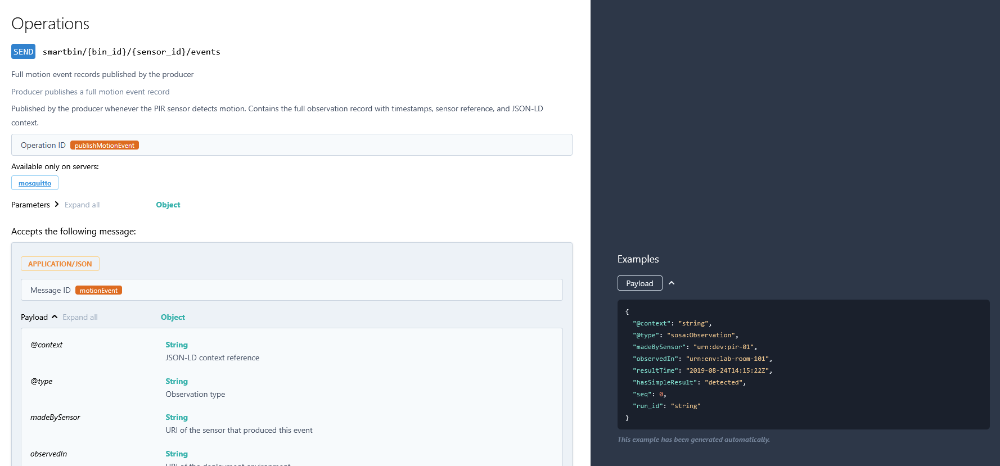

# Lab 08 — Building a REST API for the Smart Wastebin

## Section A: Runbook (How to run our code)

### Clone the Repository
If you haven't already cloned the repository, do so first:
```bash
git clone https://github.com/jimfil/raspberryPiProject.git
```

### Hardware Setup
Before running the code, ensure the PIR sensor is wired correctly to the Raspberry Pi:
- **VCC** -> Pin 2 (5V)
- **GND** -> Pin 6 (GND)
- **OUT** -> Pin 11 (GPIO17)

### Environment Setup / Activation (venv)
Navigate to the `labs/lab08` directory:
```bash
cd raspberryPiProject/labs/lab08
```

### Dependency Installation
Install the required packages using the `requirements.txt` file:
```bash
pip install -r requirements.txt
```

### Prerequisites: MQTT Broker
You need a running MQTT broker (e.g., Mosquitto) before starting the producer and consumer:


---

## Section B: Report

**RQ1: Write down your complete API design, every endpoint, its HTTP method, the URI, what parameters it accepts, and what it returns. Present this as a table.**

Ans:
| HTTP Method | URI | Parameters | Returns |
|-------------|-----|------------|---------|
| GET | `/bins/` | `limit` (int), `offset` (int) | JSON object containing a list of registered bins |
| GET | `/bins/<bin_id>` | `bin_id` (string) | Details of a specific bin |
| GET | `/bins/<bin_id>/sensors` | `bin_id` (string) | List of sensors mounted on the specified bin |
| GET | `/bins/<bin_id>/events` | `bin_id` (string), `limit` (int), `start` (string), `end` (string) | Motion events filtered for a specific bin |
| POST | `/bins/<bin_id>/emptied` | `bin_id` (string), JSON body: `emptied_at`, `emptied_by` | Record of the bin emptying event (201 Created) |
| GET | `/sensors/` | None | List of all registered sensors |
| GET | `/sensors/<sensor_id>` | `sensor_id` (string) | Details of a specific sensor |
| GET | `/events/` | `limit` (int), `start` (string), `end` (string) | All motion events recorded by the system |
| GET | `/mqtt/topics` | None | List of known MQTT topics and their last received messages |
| GET | `/mqtt/topics/<topic>` | `topic` (string) | Last received message for a specific MQTT topic |
| POST | `/mqtt/publish` | JSON body: `topic`, `payload`, `qos`, `retain` | Status of the publication request |


**RQ2: Why do the event-listing endpoints use GET and not POST? RQ3: Why does the “mark as emptied” endpoint use POST and not PUT? Think about idempotency.**

Ans:
- The event-listing endpoints use `GET` because they only retrieve data and do not modify the server's state. `GET` is meant to be a safe, read-only operation.
- The "mark as emptied" endpoint uses `POST` because it creates a new record every time it is called. Emptying a bin multiple times means multiple events occurred. `PUT` is idempotent (calling it twice has the same effect as calling it once), which wouldn't make sense for a recurring action like emptying a bin.

**RQ4: How did you handle the case where a client requests a bin or sensor that does not exist? What status code do you return and why?**

Ans:
I handled this by checking if the returned object from the helper function (`find_bin` or `find_sensor`) is `None`. If it is, the API returns a `404 Not Found` status code using `api.abort(404, ...)`. `404` is the standard HTTP status code for requesting a resource that does not exist.

**RQ5: Where does your API read its data from? Trace the path of event data from the PIR sensor all the way to an API response.**

Ans:
1. The physical **PIR sensor** detects motion.
2. The **producer** reads the GPIO pin and publishes a JSON-LD event to the MQTT broker.
3. The **consumer** subscribes to the broker, receives the event, and appends it to the local `motion_events.jsonl` file.
4. When a client requests events, the **API** parses the `motion_events.jsonl` file via the `load_events` function and returns the data as an HTTP JSON response.

**RQ6: What query parameters does your events endpoint support? Show an example request and response.**

Ans:
The `/bins/<bin_id>/events` endpoint supports `limit`, `start`, and `end`.
Example Request:
`GET /bins/bin-01/events?limit=2`
Example Response:
```json
[
  {
    "resultTime": "2026-05-05T10:00:00Z",
    "madeBySensor": "urn:dev:team05:pir-01",
    "hasSimpleResult": "detected",
    "pipeline_latency_ms": 15.2
  }
]
```

**RQ7: How do the Flask-RESTx models (api.model) relate to the Swagger UI documentation? What happens in the UI when you add a new field to a model?**

Ans:
Flask-RESTx models act as schemas that tell Swagger UI exactly what fields an object contains. When you add a new field to an `api.model` in the Python code, Swagger UI automatically updates to reflect that field in the interactive documentation and example responses, keeping the docs synchronized with the code.

**RQ8: Show a screenshot of your Swagger UI with endpoints visible.**

Ans:


#### Visible endpoints
| Method | Endpoint | Description |
| :--- | :--- | :--- |
| **GET** | `/bins/` | List all bins |
| **GET** | `/bins/{bin_id}` | Get details for a specific bin |
| **POST** | `/bins/{bin_id}/emptied` | Record that a bin was emptied |
| **GET** | `/bins/{bin_id}/events` | Get motion events for a specific bin |
| **GET** | `/bins/{bin_id}/sensors` | List sensors on a specific bin |
| **GET** | `/sensors/` | List all sensors |
| **GET** | `/sensors/{sensor_id}` | Get details for a specific sensor |
| **GET** | `/events/` | List all motion events |
| **GET** | `/mqtt/topics` | List known MQTT topics |
| **GET** | `/mqtt/topics/{topic}` | Get last message for a topic |
| **POST** | `/mqtt/publish` | Publish an MQTT message |


**RQ9: Explain how the POST /mqtt/publish endpoint works. What does the API do when it receives a publish request?**

Ans:
When the API receives a `POST /mqtt/publish` request, it extracts the `topic`, `payload`, `qos`, and `retain` fields from the JSON body. It validates the inputs, and then uses the Paho MQTT client (which is running in the background of the Flask app) to publish the message to the local Mosquitto broker.

**RQ10: You published a motion event through the API using POST /mqtt/publish. Describe the full path that message takes, from the HTTP request to the consumer’s JSONL file.**

Ans:
1. Client sends an HTTP POST request to `/mqtt/publish`.
2. The Flask API receives the request and calls `mqtt_client.publish()`.
3. The Paho MQTT client inside the API sends the message to the **Mosquitto Broker**.
4. The **consumer script**, which is subscribed to the topic, receives the message from the broker.
5. The consumer enriches the data and appends it to the `motion_events.jsonl` file.

**RQ11: What does GET /mqtt/topics return? Why does the API need to subscribe to smartbin/# for this to work?**

Ans:
`GET /mqtt/topics` returns a dictionary with the total count and a list of all known topics along with their last received message data. The API needs to subscribe to `smartbin/#` so that its internal MQTT client receives every message sent across the entire Smart Wastebin topic tree. The `on_message` callback then stores the latest payload for each topic in the `topic_store` dictionary.

**RQ12: You call POST /bins/bin-01/emptied. This both saves a record and publishes to MQTT. What is the advantage of combining both actions in one endpoint?**

Ans:
Combining both actions allows the API to act as a gateway. A single HTTP request reliably updates the historical record (saving to a database or file) and simultaneously notifies the real-time event-driven ecosystem (like Home Assistant or other MQTT subscribers) that the bin was emptied, ensuring state consistency across the whole system.

**RQ13: What is AsyncAPI and how does it relate to OpenAPI? Why do you need both for the Smart Wastebin?**

Ans:
AsyncAPI is a specification for documenting event-driven architectures (like MQTT), whereas OpenAPI is for synchronous REST APIs (like HTTP). We need both because the Smart Wastebin system has two distinct communication layers: a pull-based REST API (OpenAPI) for management/querying, and a push-based MQTT network (AsyncAPI) for real-time sensor streams and state updates.

**RQ14: How many channels did you document in your AsyncAPI spec? For each, state who is the publisher and who is the subscriber.**

Ans:
I documented 3 channels:
1. `smartbin/{bin_id}/{sensor_id}/events` - Publisher: Producer (PIR script), Subscriber: Consumer (JSONL writer).
2. `smartbin/{bin_id}/{sensor_id}/motion` - Publisher: Producer, Subscriber: Home Assistant.
3. `smartbin/{bin_id}/status` - Publisher: REST API (`/emptied` endpoint), Subscriber: Home Assistant.

**RQ15: Show a screenshot of your AsyncAPI spec rendered in Swagger Editor or AsyncAPI Studio.**

Ans:


**RQ16: Compare the MotionEvent message schema in your AsyncAPI spec with the event_model in your Flask-RESTx code. They describe the same data, what is different about the context in which each is used?**

Ans:
The AsyncAPI schema describes the raw data exactly as it is formatted when published to the MQTT broker in real-time. The Flask-RESTx `event_model` describes the data as it is formatted for HTTP clients after being processed, saved to JSONL, and queried. The REST model might include extra metadata (like `pipeline_latency_ms`) that was added later by the consumer.

**RQ17: Show the curl command and response for: (a) listing all bins, (b) getting events with a limit, (c) publishing an MQTT message, (d) requesting a nonexistent bin.**

Ans:
**(a) Listing all bins:**
```bash
curl http://192.168.137.244:5000/bins/
# Response:
{
    "bins": [
        {
            "id": "bin-01",
            "name": "Main Entrance Bin",
            "location": "Lobby",
            "status": "active"
        }
    ]
}
```

**(b) Getting events with a limit:**
```bash
curl "http://192.168.137.244:5000/bins/bin-01/events?limit=2-"
# Response:
[{"resultTime": "...", "madeBySensor": "urn:dev:team05:pir-01", "hasSimpleResult": "detected", "pipeline_latency_ms": 1.5}, 
 {"resultTime": "...", "madeBySensor": "urn:dev:team05:pir-01", "hasSimpleResult": "not_detected", "pipeline_latency_ms": 2.5}]
```

**(c) Publishing an MQTT message:**
```bash
curl -X POST http://192.168.137.244:5000/mqtt/publish \
  -H "Content-Type: application/json" \
  -d '{"topic": "smartbin/bin-01/pir-01/motion", "payload": "detected", "qos": 1}'
# Response:
{
    "status": "published",
    "topic": "smartbin/bin-01/pir-01/motion",
    "payload": "detected",
    "qos": 1,
    "retain": false,
    "mqtt_rc": 0
}
```

**(d) Requesting a nonexistent bin:**
```bash
curl -i http://192.168.137.244:5000/bins/bin-99
# Response:
HTTP/1.1 404 NOT FOUND
Server: Werkzeug/3.1.3 Python/3.13.5
Date: Thu, 07 May 2026 11:48:06 GMT
Content-Type: application/json
Content-Length: 127
Connection: close

{
    "message": "Bin bin-99 not found. You have requested this URI [/bins/bin-99] but did you mean /bins/<string:bin_id> ?"
}
```

**RQ18: What is the difference between testing with Swagger UI and testing with curl? When would you use each?**

Ans:
Swagger UI is a visual, interactive tool that makes it easy to explore endpoints, read documentation, and manually fill out parameters via a web browser. `curl` is a command-line tool that is scriptable and faster for developers who know the exact request structure. You use Swagger UI for discovery and manual testing, and `curl` for automation, quick checks, or writing bash scripts.

**RQ19: A new team member joins your project. They need to build a mobile app that shows bin status and lets users report full bins. What do you hand them? How do the Swagger UI and AsyncAPI spec help?**

Ans:
I would hand them the link to the Swagger UI and the AsyncAPI YAML file. The Swagger UI provides a complete, interactive manual for how the mobile app can pull bin statuses and push updates via HTTP REST endpoints. The AsyncAPI spec helps them understand the underlying event system, in case their mobile app needs to subscribe directly to MQTT topics for real-time notifications.

**RQ20: In your own words, explain why the Smart Wastebin needs both a push-based system (MQTT) and a pull-based system (REST API). What would be missing if you only had one?**

Ans:
The push-based system (MQTT) is crucial for real-time, low-latency communication; it allows sensors to broadcast events immediately without knowing who is listening, and lets systems like Home Assistant react instantly. The pull-based system (REST API) is necessary for structured querying of historical data and state management from client apps (like mobile apps or web dashboards) that don't need a persistent connection. Without MQTT, real-time alerts would be too slow/inefficient due to HTTP polling. Without REST, clients would have no easy way to query past events or fetch the current status on demand without subscribing to the live stream.
