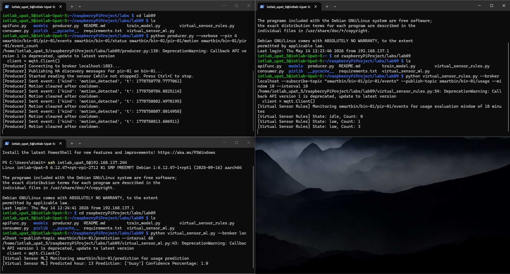

# Lab 09 — Data Processing on Edge Devices

## Section A: Runbook (How to run our code)

### Clone the Repository
If you haven't already cloned the repository, do so first:
```bash
git clone https://github.com/jimfil/raspberryPiProject.git
```

### Hardware Setup
Before running the code, ensure the PIR sensor is wired correctly to the Raspberry Pi:
- **VCC** -> Pin 2 (5V)
- **GND** -> Pin 6 (GND)
- **OUT** -> Pin 11 (GPIO17 / Physical Pin 11)

### Environment Setup / Activation (venv)
Navigate to the `labs/lab09` directory:
```bash
cd raspberryPiProject/labs/lab09
```

### Dependency Installation
Install the required packages using the `requirements.txt` file:
```bash
pip install -r requirements.txt
```

### Prerequisites: MQTT Broker
Ensure you have a running MQTT broker (e.g., Mosquitto). You can check its status:
```bash
sudo systemctl status mosquitto
```

### Running the System

To run the complete pipeline, open four separate terminals in the `labs/lab09` directory:

1. **Terminal 1: Start the Producer**
   ```bash
   python producer.py --broker localhost --pin 11
   ```
   *Reads the physical PIR sensor and publishes events to MQTT.*

2. **Terminal 2: Start the Consumer**
   ```bash
   python consumer.py --verbose
   ```
   *Listens for events and saves them to `data/` logs.*

3. **Terminal 3: Start the Rule-based Virtual Sensor**
   ```bash
   python virtual_sensor_rules.py --broker localhost --subscribe-topic "smartbin/bin-01/pir-01/events" --publish-topic smartbin/bin-01/usage --window 10 --interval 10
   ```
   *Analyzes real-time motion frequency to determine usage levels (idle, low, medium, high).*

4. **Terminal 4: Start the ML Virtual Sensor**
   First, train the model (if not already done):
   ```bash
   python train_model.py
   ```
   Then, run the ML sensor:
   ```bash
   python virtual_sensor_ml.py --broker localhost --publish-topic smartbin/bin-01/prediction --interval 60
   ```
   *Predicts the bin's usage level for the next hour using a Random Forest classifier.*

### Monitoring MQTT Traffic
You can verify the messages being published by subscribing to all smartbin topics:
```bash
mosquitto_sub -h localhost -t "smartbin/#" -v
```


---

## Section B: Report

**RQ1: What thresholds did you use for idle/low/medium/high? How did you decide on these values?**

Ans: We used the thresholds that were given to us as an example (0==idle,1-5==low,6-15==medium,16+==high) because they seemed logical, if we consider the bin to be in a public place probably in a university common area where a good number of students pass through regularly.


**RQ2: What window size did you choose and why? What happens if you make it too short (e.g., 1 minute) or too long (e.g., 60 minutes)?**

Ans: We again used the default value given (10 minutes) because we assume that the smart bin will be used at an area where a lot of students pass through as we said before. if we made it too short, like 1 minute, the usages would probably be 0 or 1 most of the times, and although we would get an extremely accurate usage time shedule, we would have 10 times the amount of data than before, making it difficult to use the data to train the smart bin for predictions, and if it is too long, like 60 minutes, we would have too few samples (24 a day) to train the smart bin for predictions, with a lot of minutes in an hour window where we don't exactly know what's accurately happening (high usage in first half hour, low usage in second for example).


**RQ3: How does the rolling window implementation (the deque) relate to what the lecture described as CEP windowed operators?**

Ans: In Complex Event Processing (CEP), windowed operators are the mechanism used to process infinite streams of data in finite "chunks." The deque (double-ended queue) is the standard data structure used to implement these windows efficiently in memory.


**RQ4: What would you need to change if you wanted to add a new level (e.g., “critical” for bins that might overflow)?**

Ans: We would need to add a counter that doesn't reset every time window that passes, only when the bin is emptied, and a threshold that can semi-accurately tell us the number of uses that fill the bin, and when the counter reaches that threshold, then the state is 'critical'.


**RQ5: What features did you use for the classifier? Why these features?**

Ans: We used the day of the week, the hour and if it is weekend or not, because it will receive the raw hour data we generated using the train_model.py and categorize it in a weekly shedule.


**RQ6: Show the classification report from training. What is the accuracy? Which class (busy/quiet) is harder to predict?**

Ans:


**RQ7: Why did we use a Random Forest classifier? Could you use a different model? What would change?**

Ans: We use a Random Forest classifier because it’s reliable, handles messy data well, and is much harder to "break" (overfit) than a single decision tree.


**RQ8: The training data is synthetic. What would change if you used real motion data collected over several weeks? What patterns might emerge that the synthetic data misses?**

Ans: The training data simulated 30 days of synthetic hourly data with realistic patterns. The real motion data could indicate a different pattern that could emerge from an event that could take place in the area of the smart bin.


**RQ9: The model publishes a confidence score alongside the prediction. Why is this useful? What should a consumer do if confidence is low (e.g., 55%)?**

Ans: The confidence score represents the probability assigned by the classifier to the most likely class, indicating how "sure" the model is about its prediction. This is extremely useful for automated decision-making. If confidence is low (e.g., 55%), a consumer application might choose to ignore the prediction, alert a human operator for manual verification, or fall back to the real-time rule-based sensor until the model provides a more certain result.


**RQ10: Give one scenario where the rule-based sensor and the ML sensor disagree. Which one would you trust more in that scenario, and why?**

Ans: If we have a smart bin in a public place, and the ML has mapped the area for enough time, it will create a shedule where we know when the bin is probably going to be full, but an unusual occurence may take place where a lot of people with trash to discard pass by our bin and use it, thus making the ML sensor untrustworthy in this scenario.


**RQ11: The rule-based sensor reacts to the present. The ML sensor predicts the future. Give one use case where each is more useful.**

Ans: The rule-based sensor would prove more useful if we have a random day in which a lot of people use the smart bin in, let's say a public area, and it detects when the bin is full or close to full. The ML sensor would prove useful in a situation where we have a smart bin or bins in a more controlled environment like an office building where the sensor has gathered enough data to predict when a bin is going to be full, or in which area, taking into account the working hours and office spaces the workers primarily have.


**RQ12: If motion patterns changed tomorrow (e.g., the bin was moved to a new location), which sensor would adapt first? What would you need to do for the other?**

Ans: The rule-based sensor would adapt first because it relies on a short-term sliding window (e.g., the last 10 minutes) to calculate current intensity, meaning it reacts immediately to changes in behavior. The ML sensor, however, would continue to predict patterns based on its training data from the old location. To adapt the ML sensor, we would need to collect several weeks of motion data at the new location and retrain the model to recognize the new temporal patterns.


**RQ13: You added two new processing components to your system without modifying the producer or consumer. How did the pub/sub architecture make this possible?**

Ans: The pub/sub architecture decouples data producers from consumers via the MQTT broker. The PIR sensor producer simply publishes raw events to a specific topic without knowing who is listening. We were able to "tap into" this stream by creating two new virtual sensors that subscribe to the same raw event topic. They process the data independently and publish their findings to entirely new topics.


**RQ14: Both virtual sensors publish to MQTT. Could a third virtual sensor subscribe to their output and combine them? Give an example.**

Ans: Yes, a third virtual sensor can subscribe to the output of two other MQTT sensors and combine them. For example, we could combine the fill level and the motion sensor, using the third virtual sensor to maybe signal to the possible users of the smart bin using a sound queue or something else that the bin is full.


**RQ15: Show a screenshot with the raw motion sensor, usage intensity, and activity prediction all visible.**

Ans: 


**RQ16: In the DIKW pyramid, where does the raw motion event sit? Where does the usage level sit? Where does the prediction sit? What moved the data up each level?**

Ans: The raw motion events like location, timestamps, temperature without context sit at the base of the DIKW pyramid, occupying the Data level. Next, we have the usage level, which sits at the Information level of the pyramid, wherewe give the ray data context and meaning so it becomes inforamtion. Lastly, we have prediction at the Knowledge level, which uses information to calculate and predict certain events happening.


**RQ17: In your own words, what is a virtual sensor? How does it differ from a physical sensor?**

Ans: Virtual sensors are software-based models of physical sensors that can simulate their behaviour and generate sensor readings without the need for actual physical hardware, unlike physical sensors.


**RQ18: If you had access to additional sensors (temperature, fill level, noise), what virtual sensor could you build by combining them? Describe the inputs, the logic, and the output.**

Ans: We could build a VS that can detect if animals made their way into the bin by combining temperature, motion and noise sensors, where if constant motion was being detecter, or/and animal sounds are being detected, or/and an unusual level of temperatureis being detected, the local animal rescue organization is going to be notified that an animal may be trapped in our smart bin.


